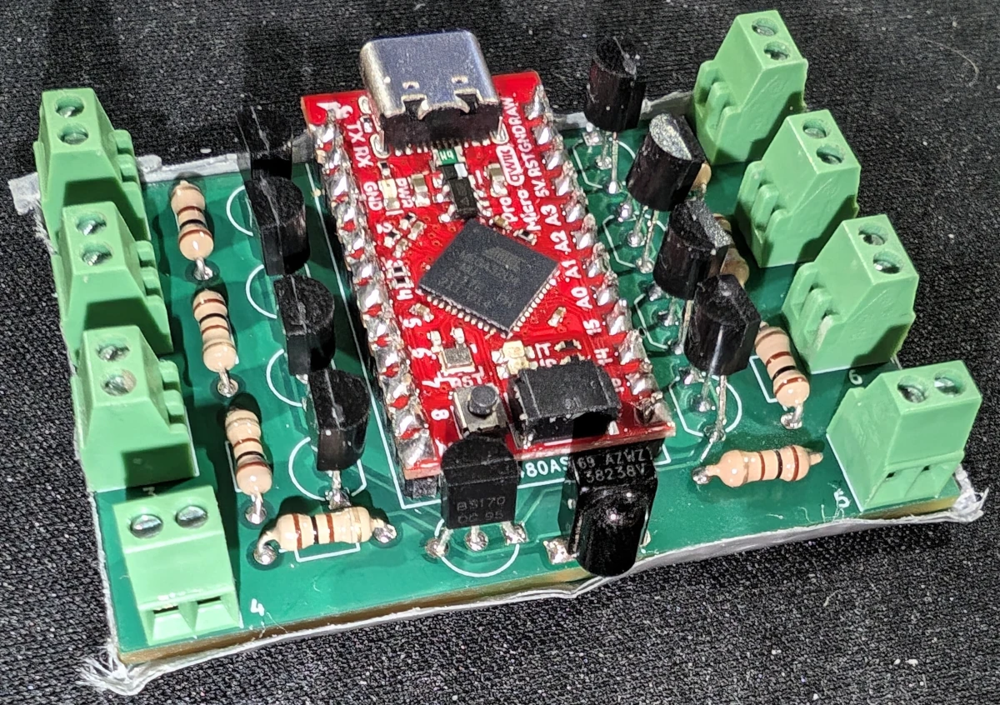
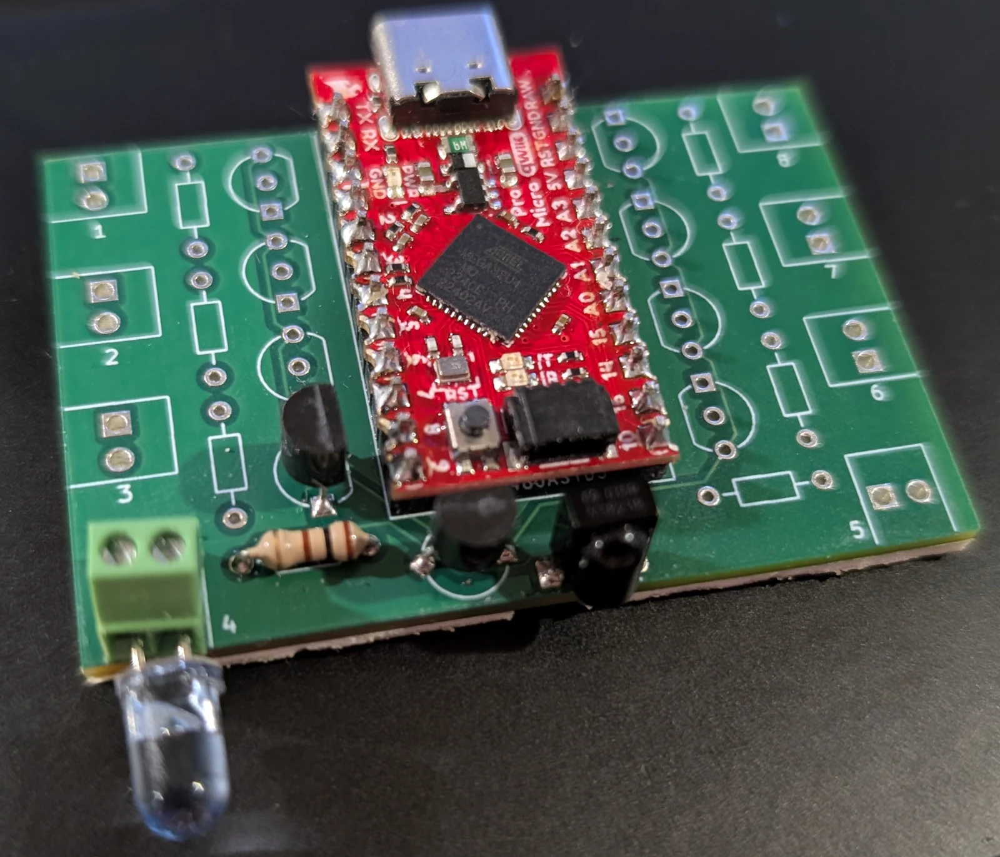

# IR-Buddy



A Thing That Does IR Remote Stuff.

## Easy To Use

IR-Buddy presents itself to a host computer as a USB Serial device and uses a simple, straightforward ASCII protocol. You can open up the device using a terminal emulator and get started right away, or you can build it into an automation system. Capturing and replaying an IR code is as easy as pointing the remote at IR-Buddy, hitting the button, and copy-pasting the output back into the terminal.

## Smart, But Not Too Smart

IR-Buddy has a couple of power features for those that want to use them. It understands the concept of codes that repeat a certain sequence when the button is held down, to make tasks like changing volume go more smoothly. The output frequency can be tweaked to a certain extent to satisfy receivers that may be slightly finicky. It has screw terminals to accept up to eight emitter LEDs, which can be individually enabled or disabled, handy for when you have multiple devices that react to the same code. All of these features are completely optional.

What do I mean by "not too smart"? IR-buddy doesn't have a concept of what *type* of code it's sending or receiving. It doesn't know NEC protocol from JVC protocol from RC5. It just sees a bunch of ON-OFF transitions, and that's what it gives you. When you want to send a code, you tell it the timing of how to send these ON-OFF transitions, and it'll do it. If you want to get fancy with interpreting or synthesizing these ON-OFF timing pairs, that's your prerogative.

## Protocol Details

IR-buddy communicates as a standard USB Serial device using the ASCII character set. Line termination is UNIX-style, using just the linefeed character (0x0a). You may need to fiddle around with your terminal emulator 

### IR Reception

Whenever IR-Buddy isn't actively receiving a code to send or sending one, it's monitoring the IR receiver for activity. When it finishes receiving one, it will print out a message that looks like this:

```
IR <ondur> <offdur> <ondur> <offdur> <...> <ondur>\n
```

`<ondur>` is the length of time that the modulated IR carrier was detected ("MARK" time), in microseconds.

`<offdur>` is the length of time that the modulated IR carrier was absent ("SPACE" time), in microseconds.

Example

I've got a CRT TV. It's an Advent somethingorother that I bought off eBay. It didn't come with a remote, so I had to buy one off eBay as well, but I digress. When I point the remote at the IR-buddy and give the power button a good press, I get:

```
IR 15866 450 1650 500 1650 500 1650 500 550 500 550 500 550 500 1650 500 550 500 550 500 1650 500 550 500 550 500 550 450 600 500 550 500 550 600
IR 22850 500 1650 450 1700 500 1650 500 500 500 550 500 550 500 1650 500 550 500 550 500 1650 500 550 500 550 500 550 500 550 500 550 500 550 600
IR 22800 500 1650 500 1650 500 1650 500 550 500 550 500 550 500 1650 500 550 500 550 500 1650 500 550 500 550 500 550 450 600 500 550 500 500 650
IR 22800 500 1650 500 1650 500 1650 500 550 500 550 500 550 500 1650 500 500 500 550 500 1650 500 550 500 550 500 550 500 550 500 550 500 550 600
IR 22850 500 1650 500 1650 500 1650 500 550 500 500 500 550 500 1650 500 550 500 550 500 1650 500 550 500 550 500 550 500 550 500 550 500 550 600
```

(And the TV turns on.) Yes, five separate lines. Remote controls tend to be fairly chatty when you press the button, and the Arduino-IRremote library that powers IR-buddy splits out any code sequence with a gap longer than about 5 milliseconds into a separate transmission.

What you're looking at is a list of timings. All values are in microseconds.

The first number after "IR" is the amount of time since the end of the last detected transmission. This is provided for when you need to combine multiple transmissions together into a single code. I happen to know a bit about this TV, and that's exactly what we're going to need to do here, as I'll explain in a bit. But first, let's discuss the rest of the line.

The next number is the "mark" time. The number of microseconds that the 38KHz infrared carrier was detected. The next number is the "space" time, the duration of time that no carrier is being sent. After that is another "mark" time. Then another "space" time. And so on.

As I mentioned, I know a bit about this TV, and I know that you need to send a code at least twice to get it to pay attention to you. So we're going to combine two of these codes together. Take the first line, and remove the "IR" from the start of it along with the first number. Then, take the second line (minus the initial "IR") and add it to the end of the first line, like so:

```
1650 500 1650 500 1650 500 550 500 550 500 550 500 1650 500 550 500 550 500 1650 500 550 500 550 500 550 450 600 500 550 500 550 600 22850 500 1650 450 1700 500 1650 500 500 500 550 500 550 500 1650 500 550 500 550 500 1650 500 550 500 550 500 550 500 550 500 550 500 550 600
```

Copy and paste this line back into the terminal emulator. You may need to press "enter" at the end as well. You should get back a line saying "RX OK". And if you're me, your TV will turn back off.

### IR Transmission

Well, we already sent our first IR code in the previous section, but I'll go into more detail here. In its simplest form, sending an IR code is just a matter of entering a quantity of "on duration", "off duration" numbers, separated by spaces, followed by a newline (aka pressing "return").

As soon as you enter a numeric character, IR-buddy will print out "RX " followed by the quantity of timing values entered thusfar. Each time you press space to start a new timing value, it will update the quantity. When you press return, it will respond with "OK" followed by a newline and transmit the code.

#### Repeat Codes

Most remotes have some sort of method of telling the thing on the other end of the room that a button is being held down. Sure, you can just send the code over and over again, but it just won't be as seamless as being able to act like the original. That's where repeat codes come in.

A ton of remotes use what's called the NEC protocol (or one of derivatives of the NEC protocol). Long story short, codes start with a 9 millisecond "attention" mark, followed by 4.5 milliseconds of space, then approximately 54 milliseconds of the actual remote data. As long as the button that initiated the code is held down, the remote announces this by sending an additional set of (9ms mark, 2.25ms space, 560 microsecond mark) every 110 milliseconds.

Here's what this looks like from IR-Buddy's perspective, using the "volume up" button on an old LG television remote as an example:

```
IR 434500 9050 4500 600 500 600 550 600 1650 600 500 600 550 600 550 600 500 600 550 600 1650 600 1650 600 500 600 1650 600 1650 600 1650 600 1650 600 1650 600 550 600 1650 600 550 600 500 600 550 600 500 600 550 600 550 600 1650 600 500 600 1650 600 1650 600 1650 600 1650 600 1650 600 1650 600
IR 40200 9050 2250 600
IR 96500 9100 2200 600
IR 96500 9100 2200 600
IR 96550 9050 2250 600
IR 96500 9050 2250 600
```

Just like the protocol describes, we see a bunch of data, followed by about 40 milliseconds of silence. Then we see the first repeat burst, followed by about 96 milliseconds of silence, then the next, and so on, and so forth.

Instructing IR-Buddy to send a code along with a repeat sequence looks like this:

```
<ondur> <offdur> <ondur> <offdur> ... <ondur> <offdur> R <ondur> <offdur> ... <ondur> <offdur>
```

So, a set of mark/space timings, ending with space, followed by "R", followed by another set of mark/space timings, ending with space.

IR-buddy will send the first set of timings, and then repeat the second set of timings until it receives another character from the terminal. It will respond with "REPEAT" instead of "OK" to announce this. When you want the repeating to stop, send any character to IR-buddy. It will respond with "OK", and return to normal operations.

Returning back to the LG volume key, this is what we'll paste to replicate its behavior:


```
9050 4500 600 500 600 550 600 1650 600 500 600 550 600 550 600 500 600 550 600 1650 600 1650 600 500 600 1650 600 1650 600 1650 600 1650 600 1650 600 550 600 1650 600 550 600 500 600 550 600 500 600 550 600 550 600 1650 600 500 600 1650 600 1650 600 1650 600 1650 600 1650 600 1650 600 40200 R 9050 2250 600 96500
```

To explain how to construct this... Take the first line we received and throw away the first value, like we've done before. The code we've got so far ends on a mark. When not using repeat codes, IR-buddy is lenient and doesn't care whether you end on a mark or a space, but when using repeat codes you always need to end on a space. So we tack the 40 milliseconds of space from the next portion of the code onto the end of what we've got so far, and then follow it up with the "R" repeat declaration. This will take care of that weirdly timed first repeat burst, so all we need to add after the repeat declaration is the 9050 mark, 2250 space, 600 mark and finally ending with the 96500 space to finish up the 110ms repeat.

#### Output LED Muxing

You may have noticed that there are separate screw terminals for attaching infrared LEDS to, and that each one has a little number next to it, from 1 to 8. This isn't just so you can spam your remote codes in all directions at once, though you *can* use it that way, if you want.

Or, consider this scenario: You've got three of the same model of TV sitting in the same room, and you only want to control a specific television while leaving the other two alone. That's exactly what setting the LED mux is for.

Using a pair of wires, you can run a LED from each of the terminals to its own dedicated television, taping it to the IR receiver with something like duct tape to ensure that each television only sees the LED that's attached to it. You can then specify which LED — or combination of LEDs — that you want a particular code to be sent to.

To make our example easy, let's say that TV 1 is being serviced by the LED in terminal 1, TV 2 by terminal 2, and TV 3 by terminal 3. Now we just want to send a code to TV 2.

Pin muxing is handled by an 8-bit binary value. Terminal 1 is activated by bit 0, terminal 2 by bit 1, terminal 3 by bit 2... all the way up to terminal 8, activated by bit 7:

| Terminal Label | Bit Number | Decimal Value |
| -------------- | ---------- | ------------- |
| 1              | 0          | 1             |
| 2              | 1          | 2             |
| 3              | 2          | 4             |
| 4              | 3          | 8             |
| 5              | 4          | 16            |
| 6              | 5          | 32            |
| 7              | 6          | 64            |
| 8              | 7          | 128           |

Specifying a mux value to use for a particular code is done by prepending the code with the mux value followed by the mux designator, "M":

```
<muxval> M <ondur> <offdur> <ondur> <offdur> ... <ondur>
```

The value is specified in decimal. So, sending a code just to our hypothetical TV 2 will look like:

```
2 M 9050 4500 600 500 600 550 etc
```

To send to TV 1 and 3 but not 2:

```
5 M 9050 4500 600 500 600 550 etc
```

To send to every terminal except our three televisions:

```
248 M 9050 4500 600 500 600 550 etc
```

The default is a mux value of 255, as in all terminals are used. You can set a muxval if 0 if you *really* want to, but of course no code will make it out.

#### Output Frequency Tweaking

As alluded to previously, the vast majority of remote controls operate using a carrier frequency of 38 KHz, meaning that a mark timing isn't comprised of just shining the LED for a duration of time, but instead is made by blinking the LED on and off 38,000 times per second. If, for whatever reason, you need a different output frequency, you can change this on a per-code basis by using the "F" frequency declaration.

Setting the default 38 KHz frequency would look like:

```
38 F 9050 4500 600 500 600 550 etc
```

Another popular frequency is 40 KHz. Most devices that expect 40KHz will respond just fine to 38KHz, but if you've got a finnicky device, then you can try 40 KHz like so:

```
40 F 9050 4500 600 500 600 550 etc
```

To be fully honest, this is just passing through the functionality that was provided by what few remnants of the original Arduino-IRremote libarary remain, and I'm just providing it in case somebody needs it.

### Switching between "ANSI" and "ASCII" output

By default, IR-Buddy does some trickery with ANSI escape codes to display the running count of timing values entered. If you don't like this for whatever reason, you can switch between ANSI output, straight ASCII output, and back by sending "A".

### Binary protocol

Maybe only using 7 out of every 8 bits isn't your style. Maybe you want something a tiny bit more machine-readable. If so, then the binary protocol might be right up your alley!

#### Opcodes

| opcode name     | hex value |
| --------------- | --------- |
| OP_IR_TRANSMIT  | 0x01      |
| OP_IR_RECEIVE   | 0x02      |
| OP_EXIT_BINARY  | 0x03      |
| OP_ACK          | 0x04      |
| OP_NAK          | 0x05      |
| OP_REPEATING    | 0x06      |
| OP_ENTER_BINARY | 0xff      |

All opcodes are kind of mushed together. Some of these (OP_IR_TRANSMIT, OP_ENTER_BINARY, OP_EXIT_BINARY) are sent *to* ir-buddy to request an action. Some (OP_IR_RECEIVE) are sent *from* ir-buddy to announce events. Some (OP_ACK, OP_NAK, OP_REPEATING) are sent from ir-buddy to announce the completion status of a request.

#### Timing division

Timing values are expressed using 16 bit unsigned integers (this is also how they're stored internally, well, for the most part). Normally this would only give you values between 0 and 65,535 microseconds, which is not long enough for many timing durations, so all of these values are divided by 10. This happens in the background and is transparent to you in ASCII mode, but that isn't the case for binary mode since we're using 16 bit unsigned integers here, too. So when you're transmitting a code, be sure to divide each of the timing values by 10 first, and whenever you're receiving a code, expect that you'll need to multiply each of the timing values you receive by 10.


#### Switching to Binary Protocol

Send OP_ENTER_BINARY. Expect a response of OP_ACK.

#### Returning back to ASCII/ANSI Protocol

Send OP_EXIT_BINARY (which is also the equivalent of entering CTRL+C repeatedly at a terminal) until you start getting ASCII "CANCEL" responses.

#### Sending an IR code

This one's a whole-ass packet.

| Name           | Length              | Description                                                                   |
| -------------- | ------------------- | ----------------------------------------------------------------------------- |
| OP_IR_TRANSMIT | 8 bits              | Tells IR-Buddy that you want to send an IR code                               |
| mux            | 8 bits              | mux value                                                                     |
| freq           | 8 bits              | transmit frequency (KHz)                                                      |
| codelen        | 16 bits             | quantity of values comprising the timings for the non-repeat part of the code |
| repeatlen      | 16 bits             | quantity of values comprising the timings for the repeating part of the code  |
| code timings   | 16 bits x codelen   | divided timing values for the non-repeat part of the code                     |
| repeat timings | 16 bits x repeatlen | divided timing values for the repeating part of the code                      |

All 16-bit values are big-endian bit order, i.e., you send the high byte followed by the low byte.

Remember that all timing values should be divided by 10 before they're converted to 16 bit values.

IR-buddy will respond with OP_ACK for codes that don't have a repeat section, or OP_REPEATING for codes that do. The code will repeat until you send a byte of data (the contents of which don't matter), after which IR-buddy will send back OP_ACK.

#### Receiving an IR code

| Name          | Length            | Description                                       |
| ------------- | ----------------- | ------------------------------------------------- |
| OP_IR_RECEIVE | 8 bits            | IR-Buddy announcing it's about to send an IR code |
| codelen       | 16 bits           | quantity of timing values that are to follow      |
| code timings  | 16 bits x codelen | divided timing values                             |

All 16-bit values are big-endian bit order, meaning you'll receive the high byte followed by the low byte.

Remember that all timing values are divided by 10, so you'll need to multiply them by 10 afterwards.

## Making Your Own

Inside the "board" subdirectory, you'll find the KiCad project, schematic, PCB layout, and associated library components, along with "bom.txt", which is the Bill of Materials. If you want to skip messing around with all the KiCad stuff, then you can upload "board/gerbers/gerbers.zip" to your favorite PCB manufacturing house.


Each of the eight IR emitters has its own section, which consists of a screw terminal, a resistor, and a BS170 transistor. The above diagram shows which components are associated with each other.

Note that in the Bill of Materials, the quantity of screw terminals, transistors, resistors, and LEDs is variable. If you only intend to use a single IR LED emitter, then of course it doesn't make any sense for you to populate the other 7 slots.

The BS170 transistor in the center of the board connects the microcontroller's IR output pin to the source of all of the other transistors, so it is mandatory. Likewise, IR reception will obviously not work if you don't solder in the IR receiver.



Here's an example of a minimum-configuration IR-Buddy.

The microcontroller firmware lives in the "firmware" subdirectory. An Ubuntu machine with the "arduino" and "arduino-mk" packages installed was used as the initial development environment. There's no reason the official Arduino IDE shouldn't work, but you're on your own as far as getting that working. Worst-case scenario, you can use it to upload "firmware/ir-buddy-static_.hex" to the microcontroller. Be sure to set the board type to "Arduino Leonardo".

## License

At the end of the day, this is all just a bunch of bits. I don't care what you do with it. I also take no responsibility for what you do with it. Except for anything in the lib/firmware directory. Those bits, heavily modified as they may be, have had a software license attached to them.
